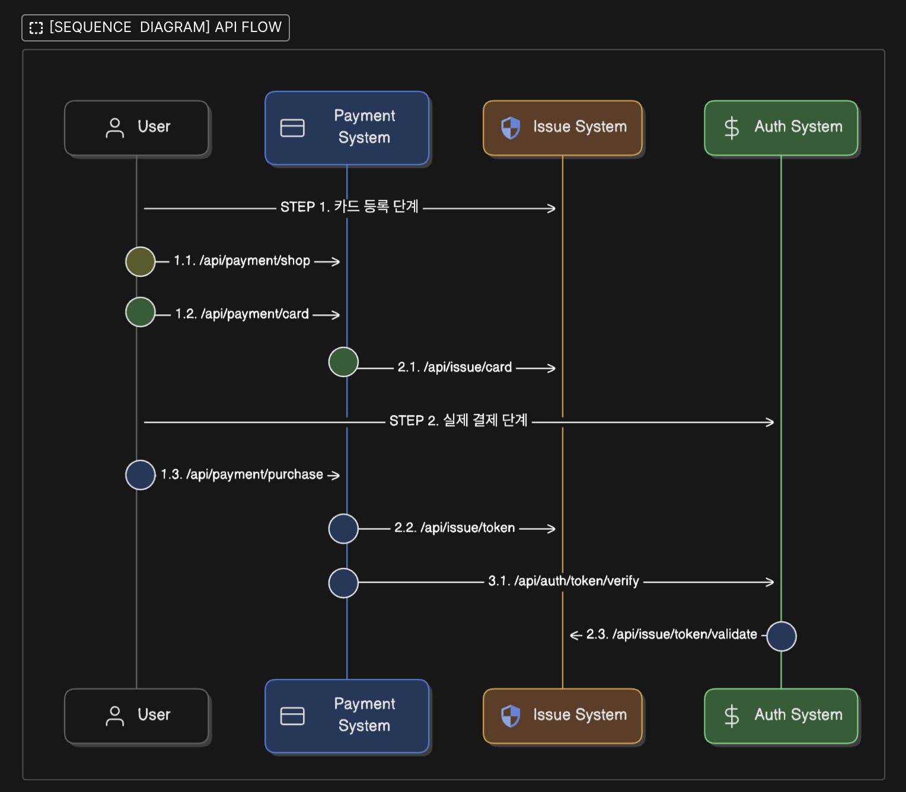
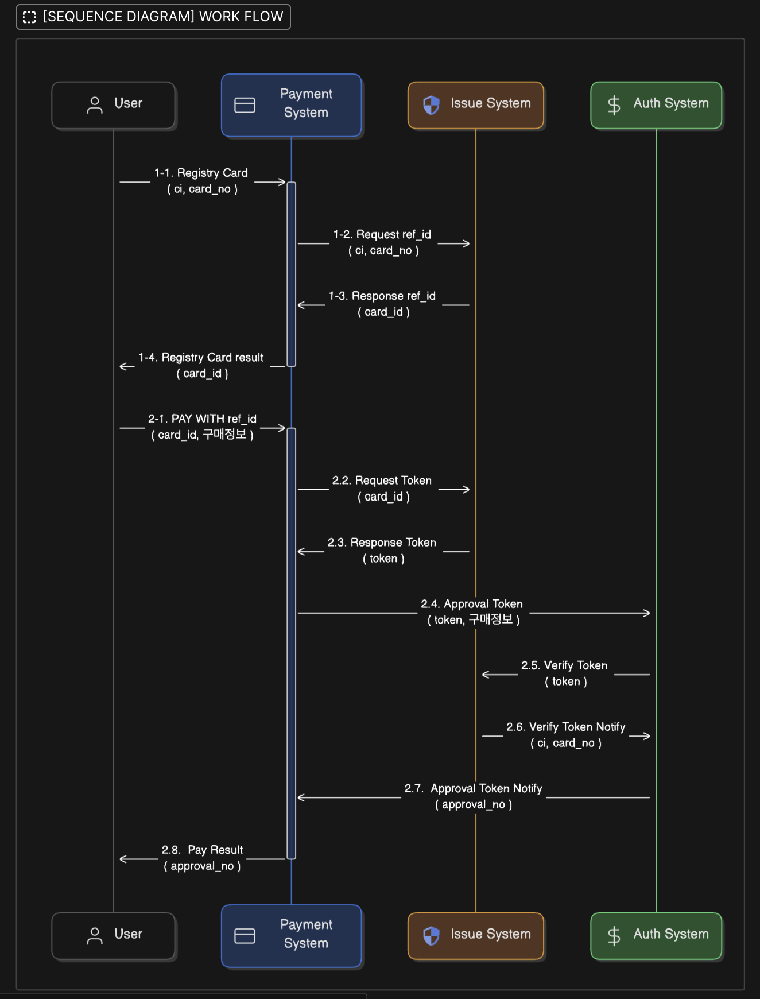
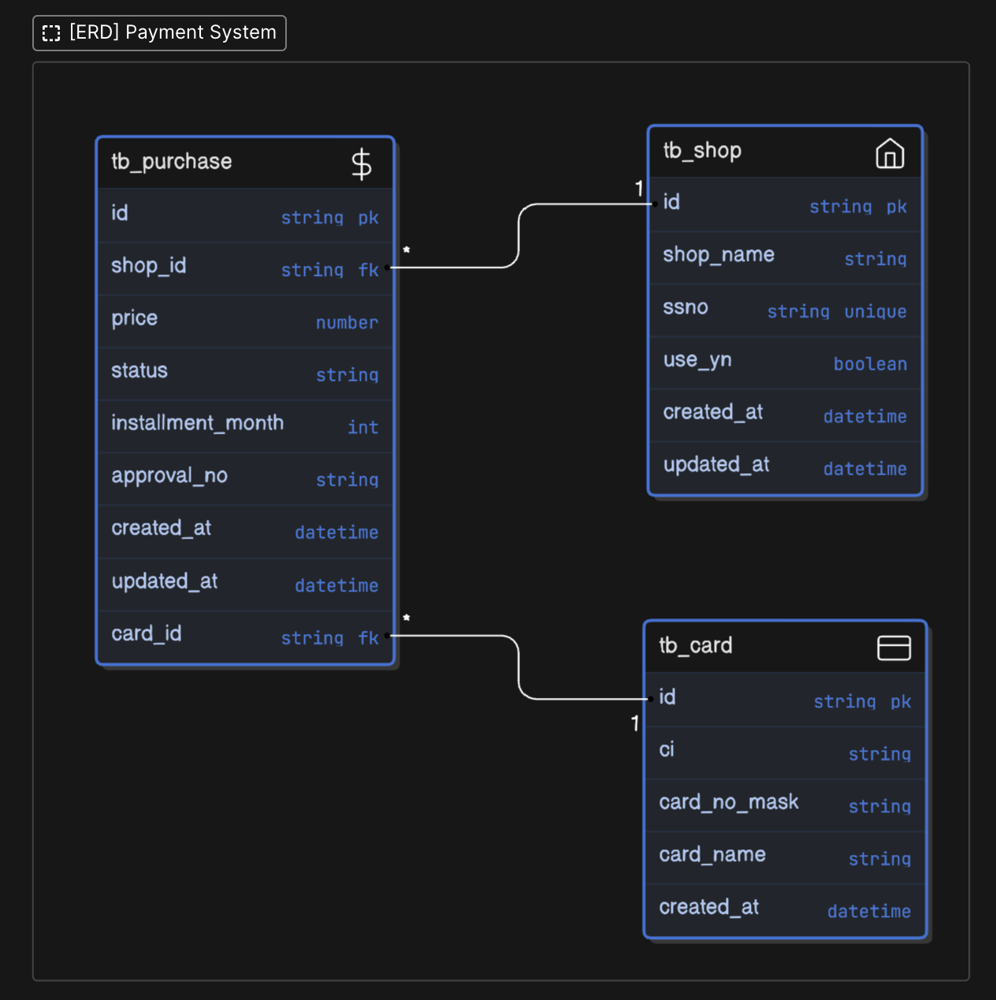
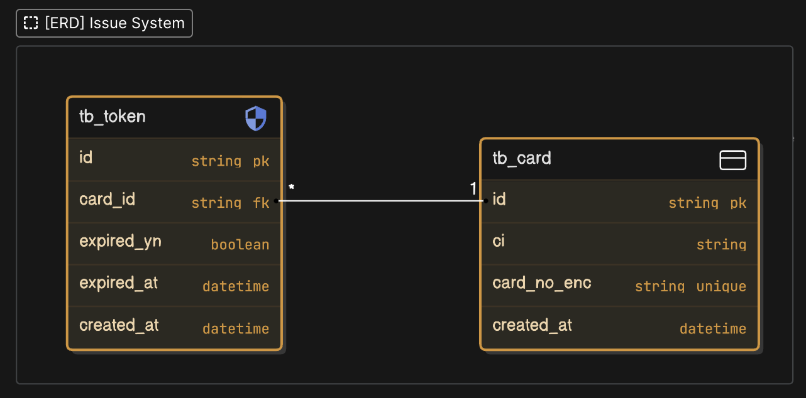
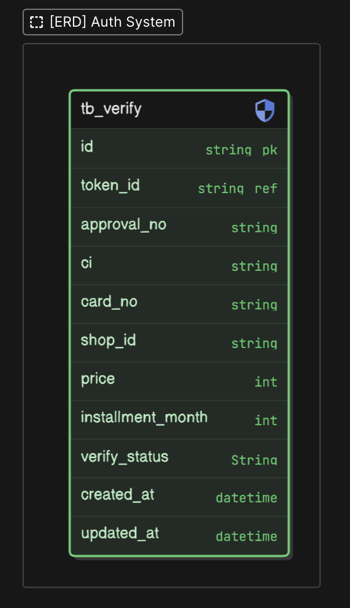
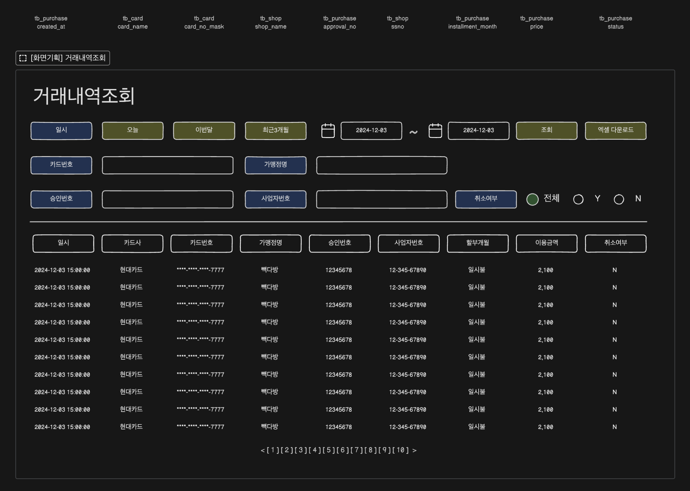

# 개요

> 토큰 기반 결제 시스템

## APPLICATION 구성

> [APPLICATION 구성 확인 : created by eraser](https://app.eraser.io/workspace/0eZxiEwDAOIbPIWdFCMl?origin=share)

1. [PAYMENT - 구매 관련 API 서버](https://github.com/wonsama/blue-payment) <<< 현재 프로젝트
2. [ISSUE - 토큰 발행 관련 API 서버](https://github.com/wonsama/blue-issue)
3. [AUTH - 승인 관련 API 서버](https://github.com/wonsama/blue-auth)

## 시스템 구성

1. language : Java 17
2. framework : Spring Boot 3.4.0
3. DB : H2

## 빌드 및 실행

> Springboot Extension Pack 설치 후 `SpringBoot Dashboard`에서 실행
> 필요에 따라 `./src/main/resources/application.properties`에서 설정 변경

### Maven 빌드 및 실행

```bash
# 빌드
./mvnw clean package
# 실행
java -jar ./target/\*.jar
```

### Docker 빌드 및 실행

```bash
# 빌드
docker build --tag payment:latest -f Dockerfile . --no-cache
# 실행
docker run -p 8080:8080 --name "payment-api" payment
```

## 스크린샷

### SEQUENCE DIAGRAM

[그림1 : 시퀀스 다이어그램 - API 흐름 : 주소]


[그림2 : 시퀀스 다이어그램 - API 흐름 : 설명]


### ERD

[그림1 : ERD - 구매정보]


[그림2 : ERD - 토큰발급]


[그림3 : ERD - 승인]


### SCREEN - 거래내역조회 (참조)

[그림4 : 거래내역조회]

